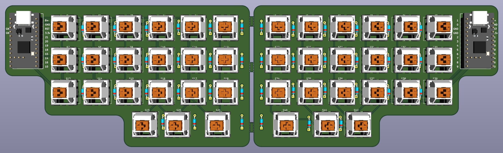

# Raven - Custom 42 key split ortholinear keyboard

## **Documentation - important if building**
This is the second keyboard I've designed, the Raven (or Raven 42) named after the bird for its wing-like design and deep purple color, much like my original prototype. I desgined the case and plate in AutoDesk Fusion, and the PCB in KiCad.

Raven is designed to use a PCB, but can be handwired if you desire. The case and plate have been designed to be easily 3d printed. This keyboard does not utilize standoffs or screws, but is desinged to simply sit in the case, using rubber bumpers to prevent the pcb from moving while typing in or out of the case.

### Parts Needed
- Raven PCB (Gerber available here)
- 42 MX style switches
- 42 1N4148 through-hole diodes
- 40 1u keycaps
- 2 1.5u keycaps
- 2 nice!nano v2 microcontroller or suitable clone (such as supermini nrf52840)
- 2 110 mAh 3.7v lithium ion battery (or smaller)
- Female pin sockets (for socketing microcontroller) - use diode legs to socket
- 8mm x 2mm rubber bumper (for case feet / pcb feet) - regular profile keycaps
- 8mm x 4mm rubber bumper (for case feet / pcb feet) - very low profile keycaps
- 11mm x 5 mm rubber bumper (for case feet)

### Case Feet
The indents for the rubber bumpers on the bottom of the case can be set up to have a positive incline if the 11x5 mm bumpers are put on the back only, or at a slight inward tilt if the 11x5mm bumpers are placed on the inward sides of the case.

### 3D Printing 
When 3D printing the case and plate, I would recommend 100% infill or as close to 100% as possible to ensure the best acoustics. Lower infill = a more hollow sound.

### Optional Case Silicon Pour
A great way to improve acoustics of this or any board is a silicon pour. With some simple 2 part silicone, that you can get from somewhere like Amazon, you can pour a thin layer of silicone at the bottom of the case. The holes in the bottom of the care are designed to hold the silicone layer better when fully cured. This is not required for ensuring the pcb doesn't slide in the case; the rubber bumbers are more than enough.

A total of 16 grams of liquid silicone in **each** case creates about a 1 mm layer at the bottom. That is 8 grams of each part if using a 2 part mixing silicone, like I did. I wouldn't go over a 1-2 mm layer to make sure the board can still easily be taking out of the case. 1 mm is good enough to dampen the sound very efficiently. 

### PCB
The gerber file provided can be uploaded to a website like JLCPCB or PCBWay to be manufactured for you. The total cost of the pcb should be around 20 dollars. (I have found that JLC is usually cheaper than PCBWay but you can check both) The PCB will come in one piece but has breakaway holes to be easily snapped in half.

Note: When solderinig on the microcontroller, the top pins on the right and left will not be attached to the pcb to give space to attach the battery. Additionally, make sure that diode strip is facing down, or keymap will be mirrored.

### Firmware
I have provided my files for my ZMK config that you can use to change the keymap to your desired configuration and recompile if you wish. You likely will want to edit the keymap anyways, but I press B with my right hand, so you will likely need to change it. Recompiling is simple, but if you do not know how to edit a keymap or compile firmware, you can watch this youtube video, https://www.youtube.com/watch?v=O_urj-rF3bQ&t=2s, or read the ZMK documentation.

